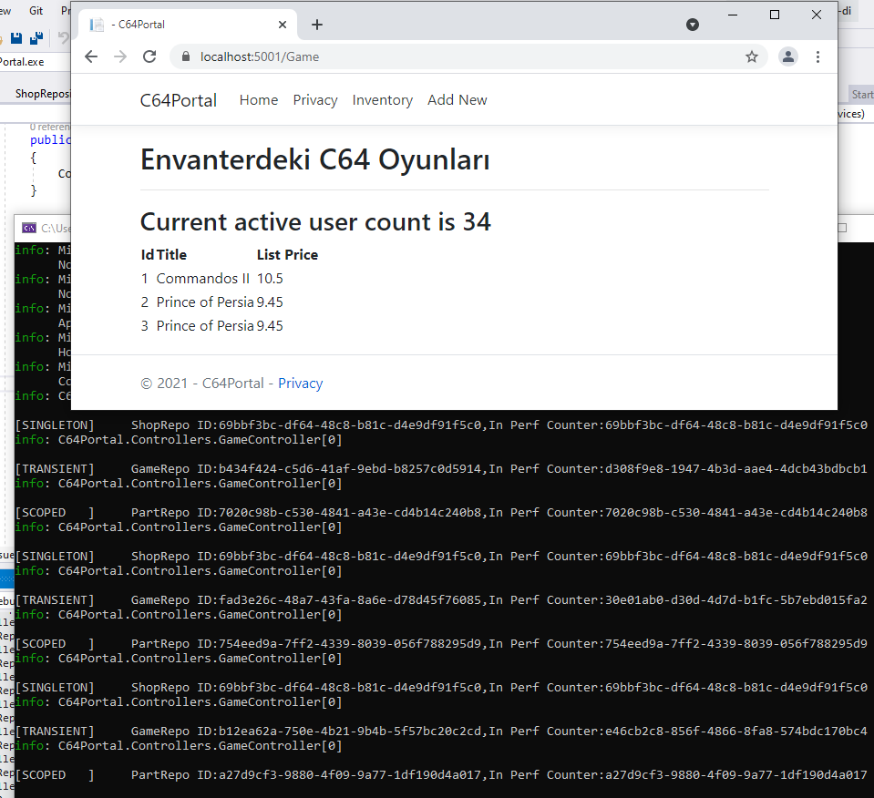
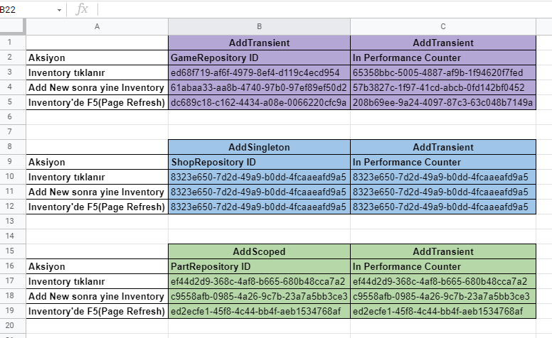

# Hands-On Asp.Net Core Dependency Injection

Asp.Net Core tarafında built-in DI mekanizmasının basit ve gösterişsiz bir örnek üstünden incelenmesi amacıyla açtığım alandır. Blogumdaki [şu](https://www.buraksenyurt.com/post/asp-net-core-a-nasil-merhaba-deriz)
yazı için destekleyicidir.

Konuyu daha iyi anlamak için farklı branch'leri kullanmaya karar verdim.

## initial: Projenin için Başlangıç Konumu 

Bu başlangıç branch'i. Kod çalışıyor ama tightly-coupled durumu söz konusu. Oluşturmak için şunlar yapıldı.

```
cd 
dotnet new sln 
dotnet new mvc -o C64Portal
dotnet sln add C64Portal
```

[https://github.com/buraksenyurt/hands-on-aspnetcore-di/tree/initial](https://github.com/buraksenyurt/hands-on-aspnetcore-di/tree/initial)

Bağımlılık ihlali GameController içerisinde, GameRepository sınıfının örneklendiği yer.

## constructor-injection: Constructor Injection Uygulanmış Hal

Bir nesnenin oluşturulurken bağımlı olduğu diğer bileşenleri arayüz üstünden almasına odaklanır. GameManager'ı, GameController içerisinde nasıl kullandığımıza ve Startup->ConfigureServices metoduna odaklanalım.

[https://github.com/buraksenyurt/hands-on-aspnetcore-di/tree/constructor-injection](https://github.com/buraksenyurt/hands-on-aspnetcore-di/tree/constructor-injection)

## method-injection: Method Injection Uygulanmış Hal

Bir metodun bağımlı olduğu nesne çözümlemesinin metoda arayüz referansı olarak çekilerek sağlanmasını ele alır. IPublisher ve RabbitPublisher tipleri ile GameController->Create metoduna odaklanalım.

[https://github.com/buraksenyurt/hands-on-aspnetcore-di/tree/method-injection](https://github.com/buraksenyurt/hands-on-aspnetcore-di/tree/method-injection)

## property-injection: Property Injection Uygulanmış Hal

IPublisher üstünden gelen bileşen bağımlılıklarını tercihe bağlı kullandırmak istediğimiz durumdaki senaryo için. Create metodundaki değişikliğe dikkat edelim.

[https://github.com/buraksenyurt/hands-on-aspnetcore-di/tree/property-injection](https://github.com/buraksenyurt/hands-on-aspnetcore-di/tree/property-injection)

## view-injection: Asp.Net Core MVC 6 ve Sonrasına Özgü

View ile Controller logic'lerini ayrıştırmak istediğimiz durumlarda işe yarayan bir tekniktir. View tarafında DataCollectorService için @inject kullanımına ve Startup->ConfigureServices metodundaki Transient kullanımına dikkat edelim.

[https://github.com/buraksenyurt/hands-on-aspnetcore-di/tree/view-injection](https://github.com/buraksenyurt/hands-on-aspnetcore-di/tree/view-injection)

## lifetimes: DI Servis Yaşam Ömürlerini Anlamak Üzerine

Servisleri AddTransient, AddScoped ve AddSingleton olarak ekleyebiliyoruz. Aradaki farkları görmek için eklenmiş branch'tir.

[https://github.com/buraksenyurt/hands-on-aspnetcore-di/tree/lifetimes](https://github.com/buraksenyurt/hands-on-aspnetcore-di/tree/lifetimes)

 

Excel üstündeki GUID'ler, örneklenen GameRepository nesnesine aittir. Farklı yaşam ömürleri için nasıl ele alındığını gösterir.

 